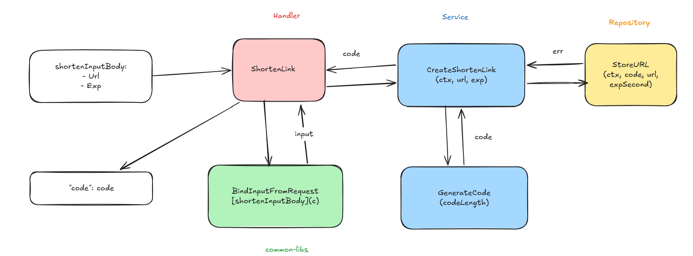
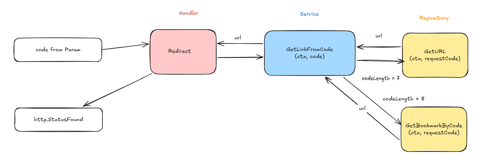
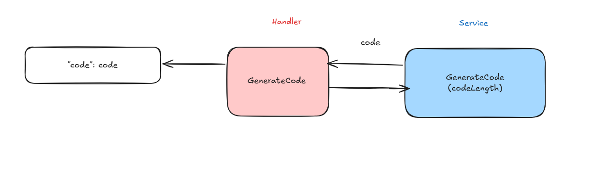
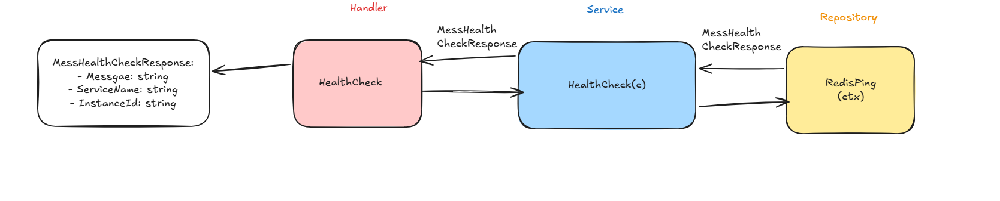
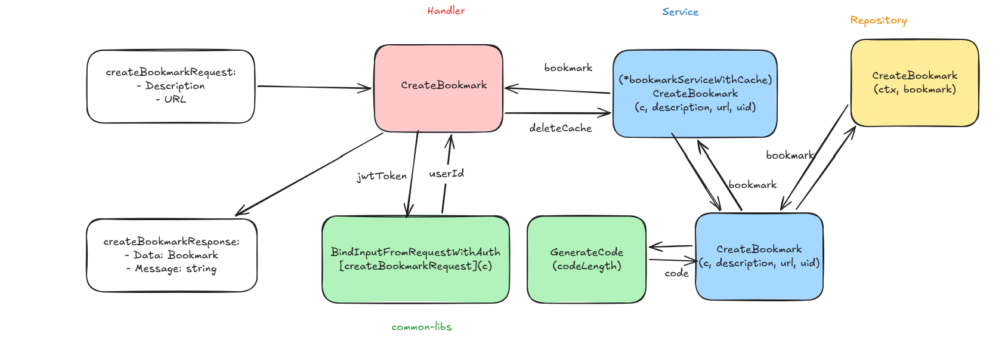
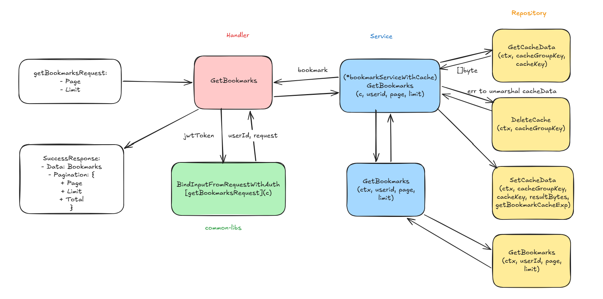
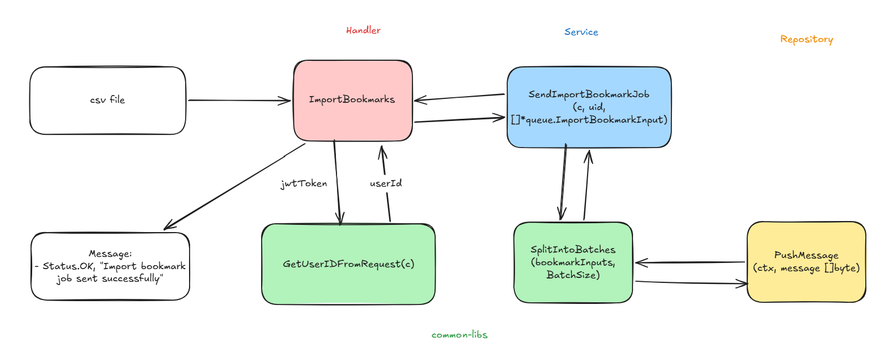
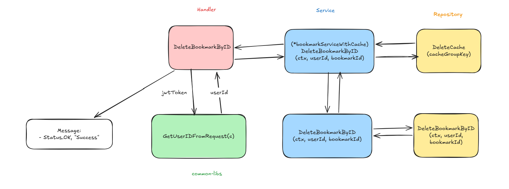
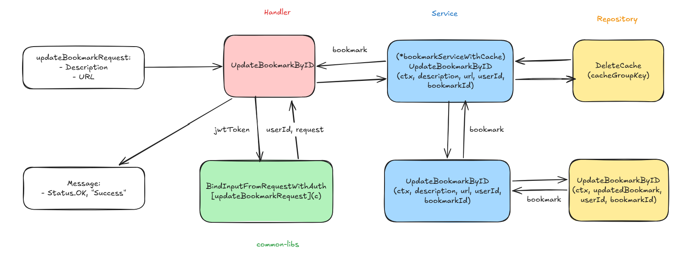

# bookmark-service

A bookmark service for the Bookmark Management system, following Clean Architecture principles.

--- 

## Tech Stack

| Layer            | Tech Stack           |
|------------------|----------------------|
| Languague        | Go 1.26+             |
| Web Framework    | Gin                  |
| Database         | PostgreSQL + GORM    |
| Cache            | Redis                |
| Message Queue    | Redis                |
| Authentication   | JWT (RSA-256)        |
| API Docs         | Swagger              |
| Monitoring       | New Relic            |
| Rate Limiting    | Redis                |
| Containerization | Docker (multi-stage) |
| Logging          | Zerolog              |
| CI/CD            | Github Actions       |

---

## Project Structure

```
bookmark-service/
├── .github/workflows/       # CI/CD pipelines
├── cmd/
│   └── api/main.go          # API server entry point
├── docs/                    # Generated Swagger documentation
├── internal/
│   ├── api/                 # Gin engine setup, routing, middleware
│   ├── app/
│   │   ├── handler/         # HTTP request handlers
│   │   ├── service/         # Business logic
│   │   ├── repository/      # Data access layer
│   │   └── model/           # Domain models
│   ├── infrastructure/      # Dependency injection, DB/Redis/JWT init
│   └── integration_test/
│       ├── data/fixture/    # Shared test data and utilities
│       ├── link/            # Integration test for link endpoint
│       ├── gencode/         # Integration test for gencode endpoint
│       ├── healthcheck/     # Integration test for healthcheck endpoint
│       └── bookmark/        # Integration test for bookmark endpoint
├── migrations/              # SQL migration files
├── postgres_data/           # DB initialization scripts
├── Dockerfile
├── docker-compose.dev.yaml
├── Makefile
├── .dockerignore
└── .gitignore
```

---

## API Endpoints

### Public

| Method | Path                      | Description         |
|--------|---------------------------|---------------------|
| `POST` | `v1/links/shorten`        | Create shorten link |
| `GET`  | `v1/links/redirect/:code` | Redirect link       |
| `GET`  | `gencode`                 | Generate code       |
| `GET`  | `health-check`            | Check health        |

#### Create a shorten link



#### Redirect link



#### Generate code



#### Check Health



### Protected (JWT Description)

| Method   | Path                  | Description                    |
|----------|-----------------------|--------------------------------|
| `POST`   | `v1/bookmarks`        | Create a bookmark              |
| `GET`    | `v1/bookmarks/get`    | Get a list of bookmarks        |
| `POST`   | `v1/bookmarks/import` | Import a csv file of bookmarks |
| `DELETE` | `v1/bookmarks/:id`    | Delete a bookmark              |
| `PUT`    | `v1/bookmarks/:id`    | Update a bookmark              |

#### Create a bookmark



#### Get a list of bookmarks



#### Import a csv file of bookmarks



#### Delete a bookmark



#### Update a bookmark



---

## Getting Started

### Prerequisites

- [Go 1.26+](https://golang.org/)
- [Docker](https://www.docker.com/) & Docker Compose
- [Make](https://www.gnu.org/software/make/)

### 1. Set up environment variables

| Variable                 | Default           | Description                                              |
|--------------------------|-------------------|----------------------------------------------------------|
| `PREFIXENV_REDIS_ADDR`   | localhost:6379    | Redis server address used by the service.                |
| `PREFIXENV_DB_HOST`      | localhost         | PostgreSQL database host.                                |
| `PREFIXENV_DB_PORT`      | 5432              | PostgreSQL database port.                                |
| `PREFIXENV_DB_USER`      | admin             | PostgreSQL database username.                            |
| `PREFIXENV_DB_PASSWORD`  | admin             | PostgreSQL database password.                            |
| `PREFIXENV_DB_NAME`      | bookmark          | PostgreSQL database name.                                |
| `PREFIXENV_NR_APP_NAME`  | bookmark-service  | New Relic application name.                              |
| `PREFIXENV_NR_LICENSE`   |                   | New Relic license key.                                   |
| `PREFIXENV_NR_USER`      |                   | New Relic user or account identifier.                    |
| `POSTGRES_USER`          | admin             | PostgreSQL username used by the database container.      |
| `POSTGRES_PASSWORD`      | admin             | PostgreSQL password used by the database container.      |
| `POSTGRES_DB`            | bookmark          | PostgreSQL database name used by the database container. |
| `TZ`                     | Asia/Ho_Chi_Minh  | Application timezone.                                    |
| `PREFIXENV_APP_PORT`     | 8080              | HTTP port on which the application listens.              |
| `PREFIXENV_LOG_LEVEL`    | info              | Global logging level.                                    |
| `PREFIXENV_BASE_PATH`    | /                 | Base path for the application's HTTP routes.             |
| `PREFIXENV_SERVICE_NAME` | bookmark-service  | Name used to identify the service.                       |
| `PREFIXENV_INSTANCE_ID`  |                   | Unique identifier for the service instance.              |


### 2. Start infrastructure (PostgreSQL + Redis)

```bash
docker-compose up redis postgres -d
```

### 3. Generate Swagger docs and run the server

```bash
make dev-run
```

The API will be available at `http://localhost:8080`.
Swagger UI: `http://localhost:8080/swagger/index.html`

---

## Development

### Run tests

```bash
make docker-test
```

> Requires 90% code coverage to pass.

### Generate Swagger docs

```bash
make swagger
```

### Generate RSA keys for JWT

```bash
make generate-rsa-key
```

---

## Docker

### Build image

```bash
make docker-build
```

### Run tests in Docker

```bash
make docker-test
```

### Push image to Docker Hub

```bash
make docker-release
```

---

## Database

### Schema

```sql
CREATE TABLE IF NOT EXISTS bookmarks
(
    id varchar(36),
    description varchar(256),
    url varchar(2048) NOT NULL,
    code varchar(10) NOT NULL,
    user_id varchar(36) NOT NULL,
    created_at TIMESTAMP WITH TIME ZONE DEFAULT CURRENT_TIMESTAMP,
    updated_at TIMESTAMP WITH TIME ZONE DEFAULT CURRENT_TIMESTAMP,
    deleted_at TIMESTAMP WITH TIME ZONE,

    CONSTRAINT bookmarks_pk PRIMARY KEY (id),
    CONSTRAINT bookmarks_code_unique UNIQUE (code)
);
```

---

## Q&A

### Configuration environment for running on docker

```
PREFIXENV_REDIS_ADDR=redis:6379
PREFIXENV_DB_HOST=postgres
```

### Configuration environment for running on local

```
PREFIXENV_REDIS_ADDR=localhost:6379
PREFIXENV_DB_HOST=localhost
```

- And remember to download the package `godotenv` to load the environment from .env file, or else you need to add the environment variables manually.